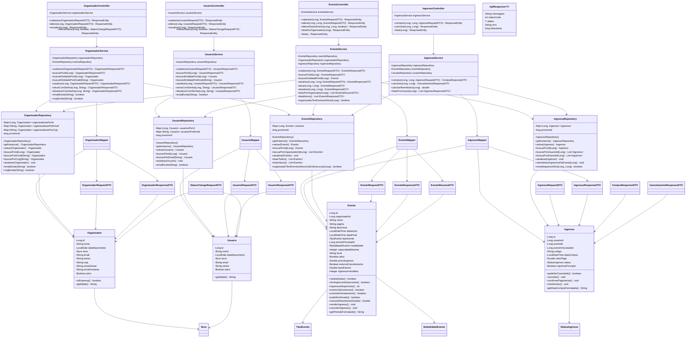

# Diagrama de Classes - Sistema de Gerenciamento de Eventos

```mermaid
classDiagram

    class UsuarioController {
        -UsuarioService usuarioService
        +cadastrar(UsuarioRequestDTO) ResponseEntity
        +alterar(Long, UsuarioRequestDTO) ResponseEntity
        +visualizar(Long) ResponseEntity
        +alterarStatus(Long, boolean, StatusChangeRequestDTO) ResponseEntity
    }

    class OrganizadorController {
        -OrganizadorService organizadorService
        +cadastrar(OrganizadorRequestDTO) ResponseEntity
        +alterar(Long, OrganizadorRequestDTO) ResponseEntity
        +visualizar(Long) ResponseEntity
        +alterarStatus(Long, boolean, StatusChangeRequestDTO) ResponseEntity
    }

    class EventoController {
        -EventoService eventoService
        +cadastrar(Long, EventoRequestDTO) ResponseEntity
        +alterar(Long, Long, EventoRequestDTO) ResponseEntity
        +alterarStatusEvento(Long, Long, boolean) ResponseEntity
        +listarDoOrganizador(Long) ResponseEntity
        +feed() ResponseEntity
    }

    class IngressoController {
        -IngressoService ingressoService
        +comprar(Long, Long, IngressoRequestDTO) ResponseEntity
        +cancelar(Long, Long) ResponseEntity
        +listar(Long) ResponseEntity
    }

    class UsuarioService {
        -UsuarioRepository usuarioRepository
        +cadastrar(UsuarioRequestDTO) UsuarioResponseDTO
        +buscarPorId(Long) UsuarioResponseDTO
        +buscarEntidadePorId(Long) Usuario
        +buscarEntidadePorEmail(String) Usuario
        +atualizar(Long, UsuarioRequestDTO) UsuarioResponseDTO
        +ativarComSenha(Long, String) UsuarioResponseDTO
        +desativarComSenha(Long, String) UsuarioResponseDTO
        +emailExiste(String) boolean
    }

    class OrganizadorService {
        -OrganizadorRepository organizadorRepository
        -EventoRepository eventoRepository
        +cadastrar(OrganizadorRequestDTO) OrganizadorResponseDTO
        +buscarPorId(Long) OrganizadorResponseDTO
        +buscarEntidadePorId(Long) Organizador
        +buscarEntidadePorEmail(String) Organizador
        +atualizar(Long, OrganizadorRequestDTO) OrganizadorResponseDTO
        +ativarComSenha(Long, String) OrganizadorResponseDTO
        +desativarComSenha(Long, String) OrganizadorResponseDTO
        +emailExiste(String) boolean
        +cnpjExiste(String) boolean
    }

    class EventoService {
        -EventoRepository eventoRepository
        -OrganizadorRepository organizadorRepository
        -IngressoRepository ingressoRepository
        +cadastrar(Long, EventoRequestDTO) EventoResponseDTO
        +buscarPorId(Long) EventoResponseDTO
        +buscarEntidadePorId(Long) Evento
        +atualizar(Long, Long, EventoRequestDTO) EventoResponseDTO
        +ativar(Long, Long) EventoResponseDTO
        +desativar(Long, Long) EventoResponseDTO
        +listarPorOrganizador(Long) List~EventoResumoDTO~
        +feedAtivos() List~EventoResponseDTO~
        +organizadorTemEventosAtivos(Long) boolean
    }

    class IngressoService {
        -IngressoRepository ingressoRepository
        -EventoRepository eventoRepository
        -UsuarioRepository usuarioRepository
        +comprar(Long, Long, IngressoRequestDTO) CompraResponseDTO
        +cancelar(Long, Long) CancelamentoResponseDTO
        +calcularReembolso(Long) double
        +listarPorUsuario(Long) List~IngressoResponseDTO~
    }

    class UsuarioRepository {
        -Map~Long, Usuario~ usuariosPorId
        -Map~String, Usuario~ usuariosPorEmail
        -long proximoId
        -UsuarioRepository()
        +getInstance() UsuarioRepository
        +salvar(Usuario) Usuario
        +buscarPorId(Long) Usuario
        +buscarPorEmail(String) Usuario
        +atualizar(Usuario) void
        +emailExiste(String) boolean
    }

    class OrganizadorRepository {
        -Map~Long, Organizador~ organizadoresPorId
        -Map~String, Organizador~ organizadoresPorEmail
        -Map~String, Organizador~ organizadoresPorCnpj
        -long proximoId
        -OrganizadorRepository()
        +getInstance() OrganizadorRepository
        +salvar(Organizador) Organizador
        +buscarPorId(Long) Organizador
        +buscarPorEmail(String) Organizador
        +buscarPorCnpj(String) Organizador
        +atualizar(Organizador) void
        +emailExiste(String) boolean
        +cnpjExiste(String) boolean
    }

    class EventoRepository {
        -Map~Long, Evento~ eventos
        -long proximoId
        -EventoRepository()
        +getInstance() EventoRepository
        +salvar(Evento) Evento
        +buscarPorId(Long) Evento
        +buscarPorOrganizadorId(Long) List~Evento~
        +atualizar(Evento) void
        +listarTodos() List~Evento~
        +listarAtivos() List~Evento~
        +organizadorTemEventosAtivosOuEmExecucao(Long) boolean
    }

    class IngressoRepository {
        -Map~Long, Ingresso~ ingressos
        -long proximoId
        -IngressoRepository()
        +getInstance() IngressoRepository
        +salvar(Ingresso) Ingresso
        +buscarPorId(Long) Ingresso
        +buscarPorUsuarioId(Long) List~Ingresso~
        +buscarPorEventoId(Long) List~Ingresso~
        +atualizar(Ingresso) void
        +reembolsarIngressosDoEvento(Long) void
        +existeIngressoAtivo(Long, Long) boolean
    }

    class Usuario {
        -Long id
        -String nome
        -LocalDate dataNascimento
        -Sexo sexo
        -String email
        -String senha
        -Boolean ativo
        +getIdade() String
    }

    class Organizador {
        -Long id
        -String nome
        -LocalDate dataNascimento
        -Sexo sexo
        -String email
        -String senha
        -String cnpj
        -String razaoSocial
        -String nomeFantasia
        -Boolean ativo
        +isEmpresa() boolean
        +getIdade() String
    }

    class Evento {
        -Long id
        -Long organizadorId
        -String nome
        -String pagina
        -String descricao
        -LocalDateTime dataInicio
        -LocalDateTime dataFinal
        -TipoEvento tipoEvento
        -Long eventoPrincipalId
        -ModalidadeEvento modalidade
        -Integer capacidadeMaxima
        -String local
        -Boolean ativo
        -Double precoIngresso
        -Boolean estornaCancelamento
        -Double taxaEstorno
        -Integer ingressosVendidos
        +validarDatas() boolean
        +temIngressosDisponiveis() boolean
        +ingressosDisponiveis() int
        +eventoJaAconteceu() boolean
        +eventoEmAndamento() boolean
        +podeSerAtivado() boolean
        +calcularReembolso(Double) Double
        +venderIngresso() void
        +cancelarIngresso() void
        +getPeriodoFormatado() String
    }

    class Ingresso {
        -Long id
        -Long usuarioId
        -Long eventoId
        -Long eventoVinculadoId
        -String codigo
        -LocalDateTime dataCompra
        -Double valorPago
        -StatusIngresso status
        -Boolean ingressoPrincipal
        +podeSerCancelado() boolean
        +cancelar() void
        +confirmarPagamento() void
        +reembolsar() void
        +getDataCompraFormatada() String
    }

    class ApiResponse~T~ {
        -String mensagem
        -int statusCode
        -T dados
        -String erro
        -long timestamp
    }

    UsuarioController --> UsuarioService
    OrganizadorController --> OrganizadorService
    EventoController --> EventoService
    IngressoController --> IngressoService

    UsuarioService --> UsuarioRepository
    UsuarioService --> UsuarioMapper
    OrganizadorService --> OrganizadorRepository
    OrganizadorService --> EventoRepository
    OrganizadorService --> OrganizadorMapper
    EventoService --> EventoRepository
    EventoService --> OrganizadorRepository
    EventoService --> IngressoRepository
    EventoService --> EventoMapper
    IngressoService --> IngressoRepository
    IngressoService --> EventoRepository
    IngressoService --> UsuarioRepository
    IngressoService --> IngressoMapper

    UsuarioMapper --> Usuario
    UsuarioMapper --> UsuarioRequestDTO
    UsuarioMapper --> UsuarioResponseDTO
    OrganizadorMapper --> Organizador
    OrganizadorMapper --> OrganizadorRequestDTO
    OrganizadorMapper --> OrganizadorResponseDTO
    EventoMapper --> Evento
    EventoMapper --> EventoRequestDTO
    EventoMapper --> EventoResponseDTO
    EventoMapper --> EventoResumoDTO
    IngressoMapper --> Ingresso
    IngressoMapper --> IngressoResponseDTO
    IngressoMapper --> Evento

    UsuarioRepository --> Usuario
    OrganizadorRepository --> Organizador
    EventoRepository --> Evento
    IngressoRepository --> Ingresso

    Evento --> TipoEvento
    Evento --> ModalidadeEvento
    Organizador --> Sexo
    Usuario --> Sexo
    Ingresso --> StatusIngresso

    UsuarioRequestDTO --> Usuario
    UsuarioResponseDTO --> Usuario
    OrganizadorRequestDTO --> Organizador
    OrganizadorResponseDTO --> Organizador
    EventoRequestDTO --> Evento
    EventoResponseDTO --> Evento
    EventoResumoDTO --> Evento
    IngressoRequestDTO --> Ingresso
    IngressoResponseDTO --> Ingresso
    CompraResponseDTO --> Ingresso
    CancelamentoResponseDTO --> Ingresso
    StatusChangeRequestDTO --> Usuario
    StatusChangeRequestDTO --> Organizador
```